class: center, middle
# Abstract Realism

Ryan Heuser |
18CR Seminar |
19 Nov 2020

---
# Abstraction in Hegel

<u>This is abstract thinking: to see nothing in the murderer except the abstract fact that he is a murderer</u>, and to annul all other human essence in him with this simple quality. ...

In quite a different manner <u>I once heard a common old woman who worked in a hospital kill the abstraction of the murderer</u> and bring him to life for honor. The severed head had been placed on the scaffold, and the sun was shining. How beautifully, she said, the sun of God's grace shines on Binder's head! — You are not worthy of having the sun shine on you, one says to a rascal with whom one is angry. This woman saw that the murderer's head was struck by the sunshine and thus was still worthy of it. She raised it from the punishment of the scaffold into the sunny grace of God, and instead of accomplishing the reconciliation with violets and sentimental vanity, saw him accepted in grace in the higher sun.

—Hegel, ‘Who thinks abstractly’ (1808)

---

# Abstraction in Locke

The use of words then being to stand as outward marks of our internal ideas, and those ideas being taken from particular things, if every particular idea that we take in should have a distinct name, names must be endless. To prevent this, the mind makes the particular ideas, received from particular objects, to become general; which is done by considering them as they are in the mind, such appearances, separate from all other existences, and the circumstances of real existence, as time, place, or any other concomitant ideas. <u>This is called ABSTRACTION, whereby Ideas taken from particular Beings, become general Representatives of all of the same kind</u>; and their Names general Names, applicable to whatever exists conformable to such abstract Ideas. ... Thus the same Colour being observed to day in Chalk or Snow, which the Mind yesterday received from Milk, it considers that Appearance alone, makes it a representative of all of that kind; and having given it the name Whiteness, it by that sound signifies the same quality wheresoever to be imagin’d or met with; and thus Universals, whether Ideas or Terms, are made.

—John Locke, *Essay Concerning Human Understanding* (1689), II.xi.9

---

# Abstraction in Aristotle

The so-called abstract objects the mind thinks just as, in the case of the snub [nose], one might think of it qua snub not separately, but <u>if anyone actually thought of it qua hollow he would think of it without the flesh in which it is embodied</u>: it is thus that the mind when it is thinking the objects of mathematics thinks of them as separate though they are not separate. In every case the mind which is actively thinking is the objects which it thinks. Whether it is possible for it while not existing separate from spatial conditions to think anything that is separate, or not, we must consider later.

—Aristotle, *De Anima*, 431b12

---

# Abstraction in art


<div style="float:left;" style="width:400px"><br/>Marcel Duchamp,<br/><i>Nude Descending a Staircase</i> (1912)</div>

<div style="float:right;" style="width:400px"><br/>Mark Rothko,<br/><i>Untitled</i> (1950-52)</div>


---

# Abstraction in programming

<center>

</center>


---

# Abstraction in Marx

It was an immense step forward for Adam Smith to throw out every limiting specification of wealth-creating activity – not only manufacturing, or commercial or agricultural labour, but one as well as the others, labour in general. […] Now, it might seem that all that had been achieved thereby was to discover the abstract expression for the simplest and most ancient relation in which human beings – in whatever form of society – play the role of producers. This is correct in one respect. Not in another. Indifference towards any specific kind of labour presupposes a very developed totality of real kinds of labour, of which no single one is any longer predominant.

<u>As a rule, the most general abstractions arise only in the midst of the richest possible concrete development</u>, where one thing appears as common to many, to all. Then it ceases to be thinkable in a particular form alone.

—Karl Marx, _Grundrisse_ (1858 [1993]), p. 98

---
# Abstraction in Koselleck

<u>A defining experience of the modern world is the loss of those specific and particularistic terms which once designated social conditions. For this reason many older concepts</u>, increasingly overtaken by events or changes in social structures that they could no longer either articulate or explain, <u>became more and more abstract</u>. From that time on, the use of collective singular nouns proliferated. Concrete usages such as stories or histories (_Geschichten_) were replaced by the more abstract term history (_Geschichte an sich_). Separate advances in one or another field now were lumped together as progress.

—Reinhart Koselleck, _Geschichtliche Grundbegriffe_, “Introduction” (1972)

---
# Corpora

```
|-----------------------------------------------------------------------|
| Genre   | Corpus              | Period    | # Texts   | # Words       |
|:--------|:--------------------|:----------|:----------|:--------------|
| Essay*  | EEBO_TCP            | 1606-1699 | 301       | 7,091,680     |
|         | HathiEssays         | 1666-1987 | 6,977     | 418,685,439   |
|         | ECCO                | 1701-1799 | 5,073     | 250,376,088   |
|         | ECCO_TCP            | 1701-1799 | 85        | 2,398,259     |
|-----------------------------------------------------------------------|
| Fiction | Chadwyck            | 1582-1897 | 1,331     | 122,372,339   |
|         | GaleAmericanFiction | 1785-1920 | 18,177    | 1,197,051,803 |
|         | COHA                | 1810-2009 | 9,965     | 178,041,359   |
|         | Chicago             | 1880-2000 | 9,089     | 891,824,643   |
|         | MarkMark            | 1881-2011 | 355       | 51,367,057    |
|-----------------------------------------------------------------------|
| Verse   | ChadwyckPoetry      | 1581-2004 | 281,123   | 130,238,989   |
|-----------------------------------------------------------------------|


* Volumes self-describing as 'essay(s)' in their title
```

---
# Example words

* **Abstract words**: forensic, indefatigability, foppery, deaconship, qualitative, remark, aiding, indemonstrable, intelligently, illiteracy, motherliness, disquieter, paramountcy, sinlessness, blatant, inexorably, aggrievance, corrupt, biologist, isolating, loveliness, hyperbole, globalization, inscrutable, prospectively, priestcraft, misapplication, reputation, mispleading, fervour, individuality, unrepented, coercionist, implicate, relish, lexicographical, gustable, rigidly, subsidiarity, popery, oppressing, politic, emulation, voicing, prophetism, incogitancy, invalidly, austere, seriousness, unedifying, fragility, apathy, officiary, dissimilarly, re-examine, iterable, withdrawment, ...


* **Concrete words**: crayon, kangaroos, crocus, nails, slabbering, saucisson, concave, jaw, bottled, sedan, twisty, unhewn, three-forked, purplish, citronella, counterpane, brass, coppice, saw-pit, digs, teen-ager, stampeding, ploughed, shelving, deftly, beef, lime, soak, embrasure, steading, grazing, dangled, flaked, fog, ginseng, unscrewed, brimmed, bulge, basement, lobster, gecko, top-ropes, fore-end, sidebar, rooms, scabby, snivel, room,  blanket, cloven-footed, parkway, amygdala, faintish, scenting, orange-peel, ribbons, fleshed, clad, drumstick, lead-colour, corn-powder, knock, piecrust, hairless, rockery, hair-colour, chaser, silvery, cottony, cigar, stitching, blanquette, ... 

---
background-image: url(imgs/fig1-essay-v-fiction.abs.png)
# Frequency of abstract words
In
<span style="color:#e59354; font-weight: bold;">fiction</span>,
<span style="color:#7b77b6; font-weight: bold;">verse</span>,
and
<span style="color:#42a789; font-weight: bold;">essays</span>,
1600-2000

---
background-image: url(imgs/fig1-essay-v-fiction.conc.png)
# Frequency of concrete words
In
<span style="color:#e59354; font-weight: bold;">fiction</span>,
<span style="color:#7b77b6; font-weight: bold;">verse</span>,
and
<span style="color:#42a789; font-weight: bold;">essays</span>,
1600-2000

---
# Computing meaning: Empirical methods
- Charles E. Osgood in *The Measurement of Meaning* (1957) proposed the 'semantic differential' method:
.center[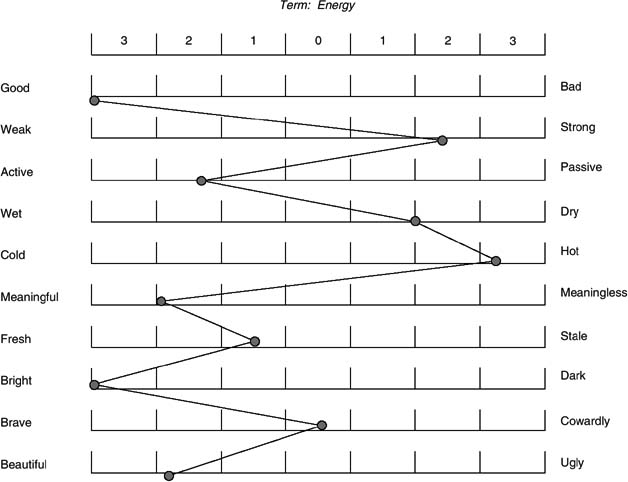]
---
# Computing meaning: Empirical methods
- Paivio et al, 'Concreteness, imagery and meaningfulness values for 925 words', _Journal of Experimental Psychology Monograph Supplement_ (1968)
.center[]
---
# Computing meaning: Empirical methods
- Charles E. Osgood, *The Measurement of Meaning* (1957)

- Paivio et al, 'Concreteness, imagery and meaningfulness values for 925 words', _Journal of Experimental Psychology Monograph Supplement_ (1968)

- Gilhooly et al, 'Age-of-acquisition, imagery, concreteness, familiarity, and ambiguity measures for 1,944 words', _Behavior Research Methods_ (1980)

- Coltheart, 'The MRC Psycholinguistic Database', _Quarterly Journal of Experimental Psychology_ (1981)

- Nickerson et al, 'The University Of Colorado Meaning Norms', _Behavior Research Methods_ (1984)

- Brysbaert et al, 'Concreteness ratings for 40 thousand generally known English word lemmas', _Behavior Research Methods_ (2014)

- Lynott et al, 'Lancaster Sensorimotor Norms: Multidimensional measures of Perceptual and Action Strength for 40,000 English words', _Open Science Foundation_ (2019)


---
# Frequency of abstract/concrete words: Empirical methods

.cols[
.thirty[
<h4>9 psycholinguistic definitions of <span style="color:#1c9e77">abstract</span> and <span style="color:#d46917">concrete</span> words produce similar results across history of fiction</h4>

<small>
1. **HGI**: Harvard General Inquirer, "Concrete" and "Abstract" (~1957)
2. **LSN-Perc**: Lancaster Sensorimotor Norms, Perceptual strength (2019)
3. **LSN-Sens**: Lancaster Sensorimotor Norms, Perceptual strength (2019)
4. **MRC-Conc**: MRC Psycholinguistic Database, Concreteness (1981)
5. **MRC-Imag**: MRC Psycholinguistic Database, Imagability (1981)
6. **MT**: Brysbaert et al, Concreteness (2014)
7. **PAV-Conc**: Paivio et al, Concreteness (1968)
8. **PAV-Imag**: Paivio et al, Imagability (1968)
9. **WN**: WordNet Lexical Database (1985)
</small>
]
.seventy[

]
]


---
# Computing meaning: Distributional semantics

- Zellig Harris: "Difference of meaning correlates with difference" of a word's textual "environments."

##### 'Environment' of the word 'book'

```
for the observation is made in a  book  not much read now a days.-- But 
gnificance. The perusal of Fox's  Book  of Martyrs, of which I was so fo
s those of her face; and, like a  book  printed in a large letter, the w
ded by Lord Bacon, in his little  Book  of Apophthegms, where he says, "
y of Sin and Death in the second  Book  of Paradise Lost. Detraction hen
 my papa. Before, I had always a  book  in my hand; now I shall be emplo
ill beg you to tell me what fine  book  of prints that is, that ies open
ine walking in the garden with a  book  in his hand. I am very much afra
its down, seeming to read in his  book  with great attention.) What a fi
er any constraint now. (Puts the  book  into his pocket.) What an opinio
```

##### 'Environment' of 'letter':

```
ires, therefore counterfeiced a  letter  from him, inviting Mr. Lambton 
 word; and before I thought the  letter  had reach'd 'em, they were in m
er, Tom; My Lord, take you that  letter  to the ladies; Bid them be merr
mbers of the October Club; in a  Letter  from a Person of Honour, 2d Edi
 ah! [Exeunt. "Dear sister, The  letter  I now write is almost needless,
old! You have been reading that  letter  again. I do believe I shall nev
? First then,-- have I not your  Letter  by me, sent to me when in Engla
mself, would frequently leave a  Letter  for himself:-- 'Faith, you are 
tagem takes: I have written the  letter  we projected, and it answers ou
in my usual character, a single  letter  would have betrayed me to CARLI
```

<!-- .center[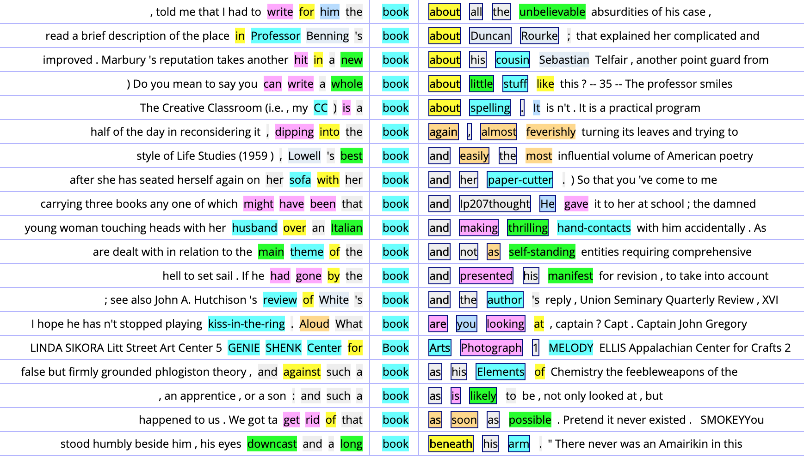] -->

---
# Computing meaning: Distributional semantics

.cols[
.thirty[
#### Word embedding models encode semantic similarity as spatial proximity

Model: ECCO (18th century, all genres)

Words: Most frequent 1,000 nouns

300 dimensions reduced to 2 by T-SNE dimensionality reduction algorithm

]
.seventy[
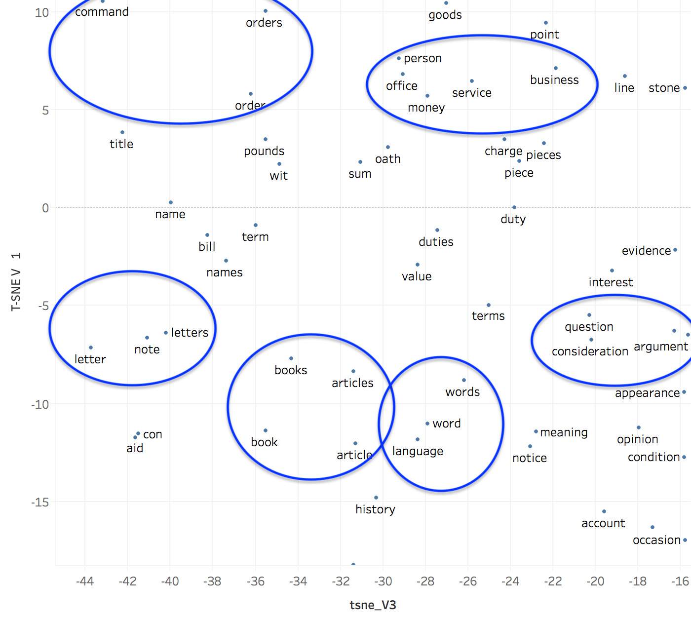
]
]


---
# Computing meaning: Distributional semantics

.cols[
.thirty[
#### Word embedding models encode semantic similarity as spatial proximity

Model: ECCO (18th century, all genres)

Words: Most frequent 1,000 nouns

300 dimensions reduced to 2 by T-SNE dimensionality reduction algorithm

]
.seventy[

]
]


---
# Computing meaning: Distributional semantics

.cols[
.thirty[
#### Word embedding models encode semantic similarity as spatial proximity

Words marked as maximally "<u>concrete</u>" (defined as perceptible to the senses) by participants in Brysbaert et al's psycholinguistic study

]
.seventy[

]
]


---
# Computing meaning: Distributional semantics

.cols[
.thirty[
#### Word embedding models encode semantic similarity as spatial proximity

Words marked as maximally "<u>abstract</u>" (defined as imperceptible to the senses) by participants in Brysbaert et al's psycholinguistic study

]
.seventy[
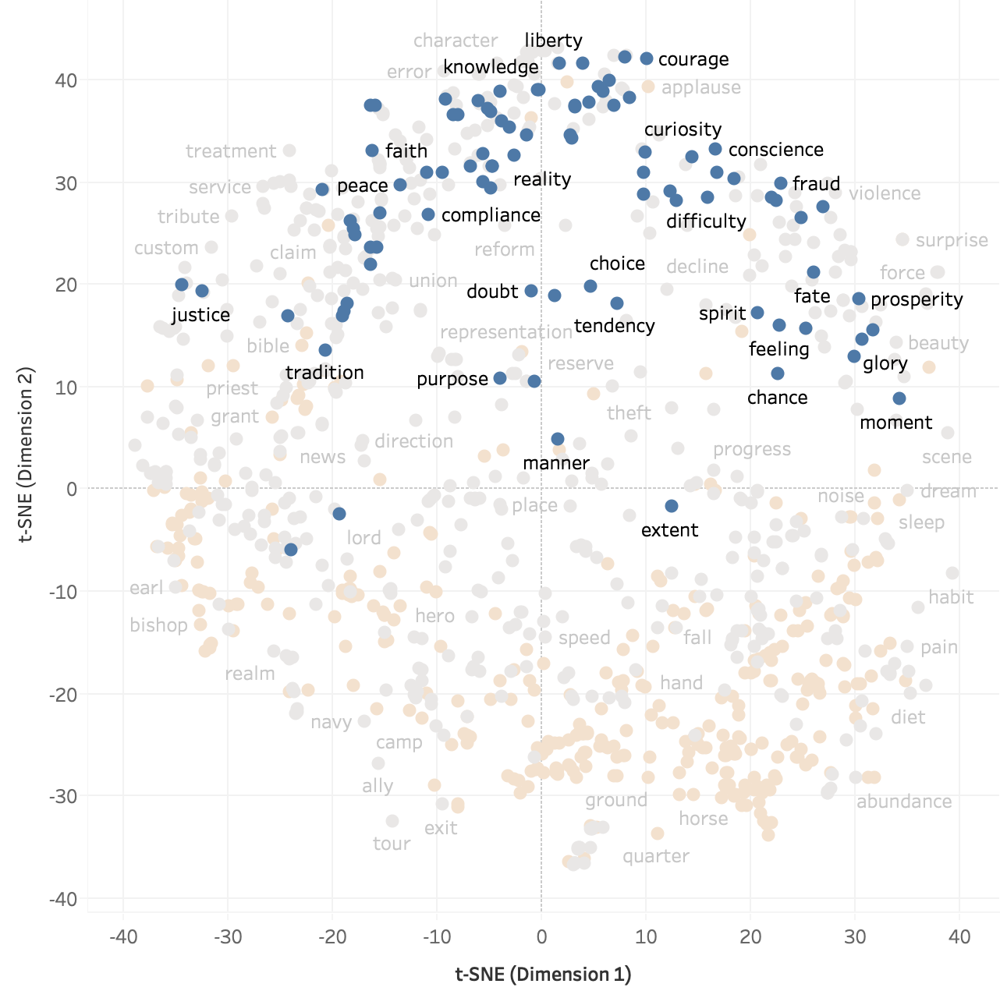
]
]


---
# Computing meaning: Distributional semantics

.cols[
.thirty[
#### Word embedding models encode semantic similarity as spatial proximity

Step 1: Find the center of the vector space occupied by a range of concrete words. = V([Concrete words])

]
.seventy[
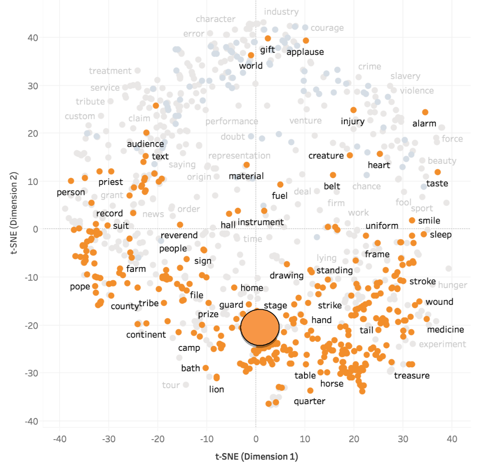
]
]


---
# Computing meaning: Distributional semantics

.cols[
.thirty[
#### Word embedding models encode semantic similarity as spatial proximity

Step 1: Find the center of the vector space occupied by a range of concrete words. = V([Concrete words])

Step 2: Find the center of the vector space occupied by a range of abstract words. = V([Abstract words])

]
.seventy[

]
]


---
# Computing meaning: Distributional semantics

.cols[
.thirty[
#### Word embedding models encode semantic similarity as spatial proximity

Step 1: Find the center of the vector space occupied by a range of concrete words. = V([Concrete words])

Step 2: Find the center of the vector space occupied by a range of abstract words. = V([Abstract words])

Step 3: Compute the vector-difference between them. = V([Abstract words]) - V([Concrete words])

]
.seventy[
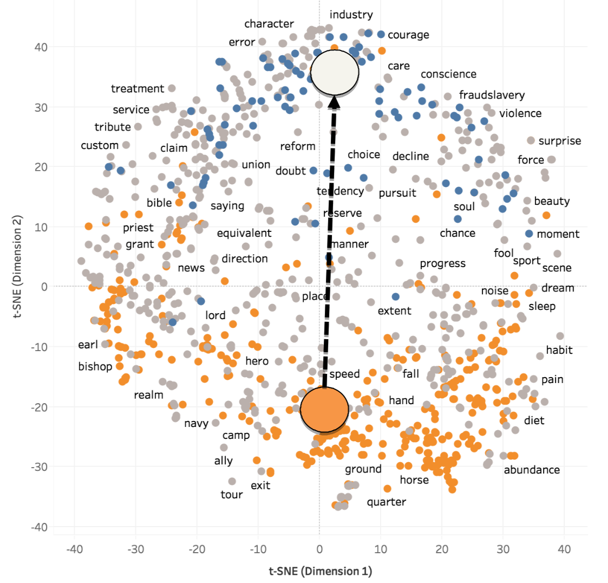
]
]


---
# Computing meaning: Distributional semantics

.cols[
.thirty[
#### Word embedding models encode semantic similarity as spatial proximity

Y-axis: Abstractness in the eighteenth-century, according to V(Abstract-Concrete)

X-axis: records a word's average frequency per million words.

]
.seventy[
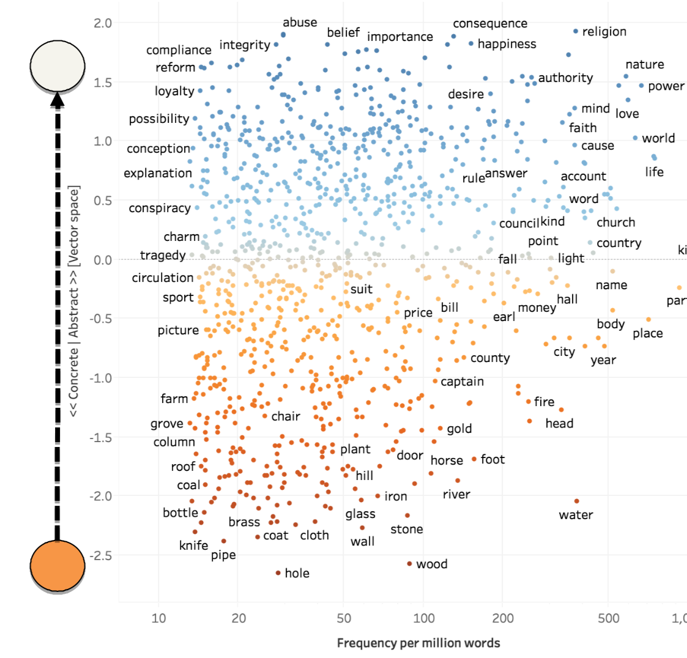
]
]


---
# Computing meaning: Distributional semantics

.cols[
.thirty[
#### Word embedding models encode semantic similarity as spatial proximity


Y-axis: Abstractness in the eighteenth-century, according to V(Abstract-Concrete)

X-axis: Contemporary psycholinguistic measure of abstractness.

Correlation: R^2=0.55

]
.seventy[
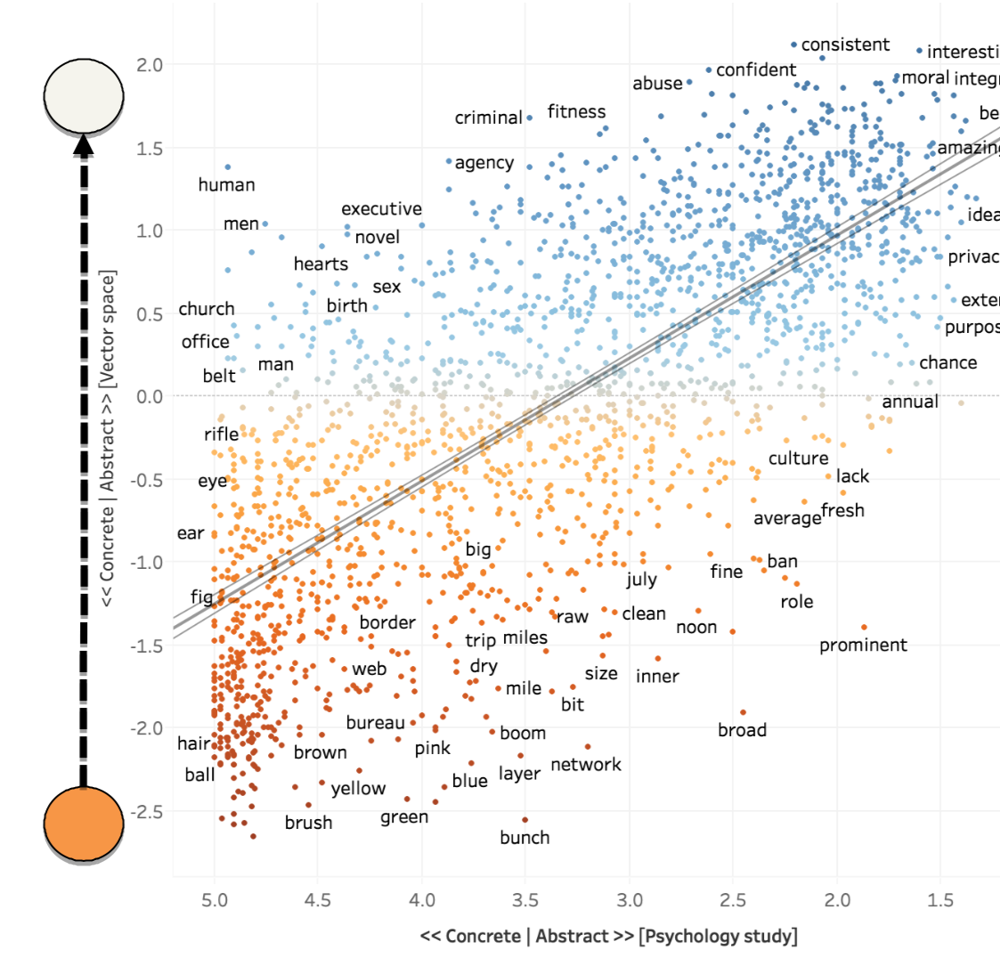
]
]


---
# Computing meaning: Distributional semantics

.cols[
.thirty[
#### Word embedding models encode semantic similarity as spatial proximity


Y-axis: Abstractness in the eighteenth-century, according to V(Abstract-Concrete)

X-axis: Contemporary psycholinguistic measure of abstractness.

Correlation: R^2=0.55

]
.seventy[

]
]

---
# Computing meaning: Distributional semantics

.cols[
.thirty[
#### Measuring the extent to which words have changed in meaning from 1750s to 1850s (Koselleck's *Sattelzeit*)

X-axis: Degree to which a word's overall associations have changed.

Y-axis: Degree to which a word's abstractness has changed.

Showing abstract nouns within the top 5,000 most frequent words for both decades.

Model: British Periodicals Online
]
.seventy[
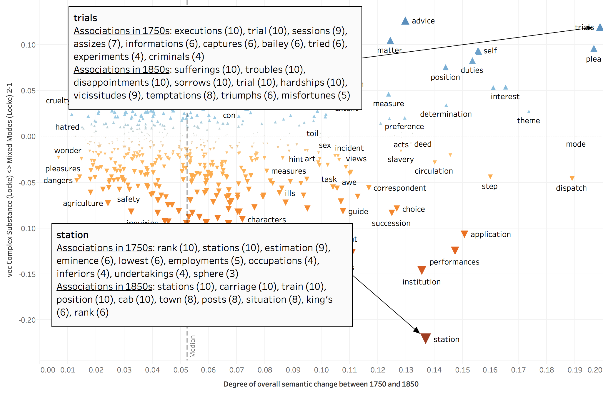
]
]


---
# Computing meaning: Distributional semantics

.cols[
.thirty[
#### Measuring the extent to which words have changed in meaning from 1750s to 1850s (Koselleck's *Sattelzeit*)

X-axis: Degree to which a word's overall associations have changed.

Y-axis: Degree to which a word's abstractness has changed.

Showing abstract nouns within the top 5,000 most frequent words for both decades.

Model: British Periodicals Online
]
.seventy[

]
]


---
# Frequency of abstract/concrete words: Empirical methods + Computational refinement

.cols[
.thirty[
<h4>54 definitions of abstract and concrete words show similar results over history of fiction</h4>

<div style="line-height:1em; font-size:0.8em;">
<p>Y-axis: Standardized ratio of abstract to concrete words</p>

<p>Fields: For each of the <b>9</b> psycholinguistic definitions, <b>4</b> historical variants (C17, C18, C19, C20), <b>1</b> median across these variants, and <b>1</b> original field = <b>54 separate fields</b></p>

<p>Method: 25 word2vec models trained decade by decade over:</p>

<ul>
    <li><b>C17</b>
      <ul><li>EEBO (124K texts; 648M words)</li></ul>
    </li>
    <li><b>C18</b>
    <ul>
      <li>ECCO (151K texts; 7B words)</li>
      <li>British Periodicals Online (326K texts; 488M words)</li>
    </ul></li>
    <li><b>C19</b>
    <ul>
        <li>British Periodicals Online (1.7M texts; 3.9B words)</li>
        <li>Corpus of Historical American English (10K texts; 122M words)</li>
    </ul>
    </li>
    <li><b>C20</b>
    <ul><li>Corpus of Historical American English (92K texts; 228M words)</li></ul>
</ul>
</div>
]
.seventy[
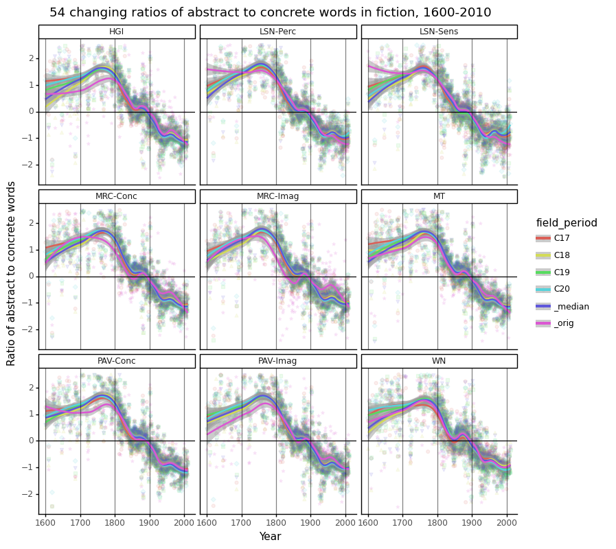
]
]


---
background-image: url(imgs/thesaurus_abs.png)
# Heatmap of abstract words across OED
Abstract words most found in the <span style="color: #124a86; font-weight: bold">bluer</span> categories

---
background-image: url(imgs/thesaurus_conc.png)
# Heatmap of concrete words across OED
Concrete words most found in the <span style="color: #a71429; font-weight: bold">redder</span> categories


---
# Jane Austen (1811) vs. Rachel Cusk (2014)


---
# Jane Austen (1811) vs. Rachel Cusk (2014)


---
background-image: url(imgs/abstract-novels.Abs-Conc.ALL._median.v2--anno-austen-cusk.png)
# Ratio of abstract to concrete words
In canonical fiction, 1600-2000

---
# Realism and concreteness

The novel arose in the modern period, a period whose general intellectual orientation was most decisively separated from its classical and mediaeval heritage by its rejection ... [of] the view held by the scholastic Realists of the Middle Ages that it is universals, classes or abstractions, and not the <u>particular, concrete objects of sense-perception, which are the true 'realities'</u>.

—Ian Watt, Rise of the Novel (1957)

--

<br/>
<br/>
It will be appropriate to associate rise of affect with the emergence of the phenomenological body in language and representation; and to <u>historicize a competition between the system of named emotions and the emergence of nameless bodily states</u> which can be documented in literature around the middle of the nineteenth century (literary representation furnishing the most comprehensive evidence as to a momentous yet impossibly hypothetical historical transformation of this kind). […] it is therefore words themselves (the <u>medieval universals) which are incompatible with the body and its affects</u>.

—Fredric Jameson, Antinomies of Realism (2013)

---
# Realism and concreteness


---
background-image: url(imgs/trendmap.png)
# Ratio of abstract to concrete words
In canonical fiction, 1600-2000

---

background-image: url(imgs/trendmap--picaresque.png)
# Ratio of abstract to concrete words
In canonical fiction, 1600-2000

---

# Concrete language in the picaresque
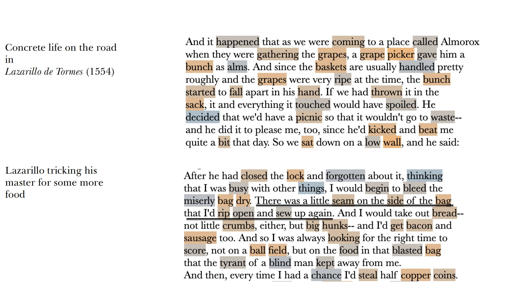

---

background-image: url(imgs/trendmap--romance.png)
# Ratio of abstract to concrete words
In canonical fiction, 1600-2000

---

# Abstract and concrete language in the romance
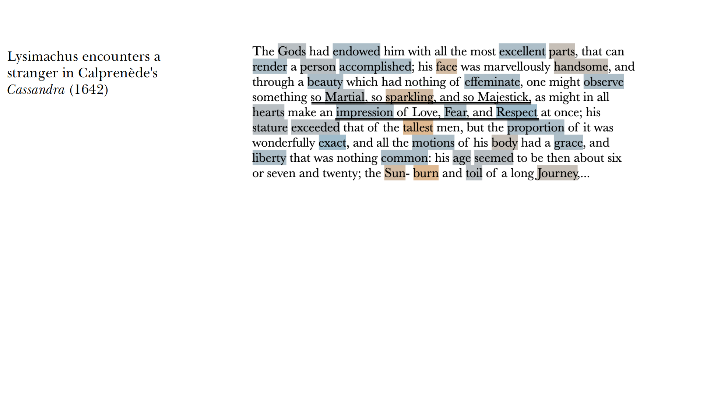

---

# Abstract and concrete language in the romance


---

# Abstract and concrete language in allegory
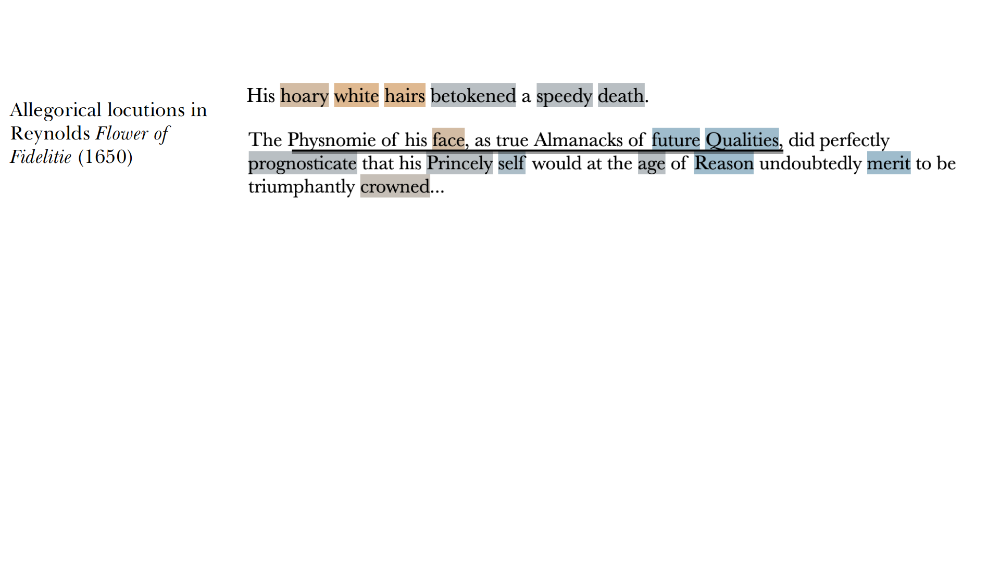

---

# Abstract and concrete language in allegory
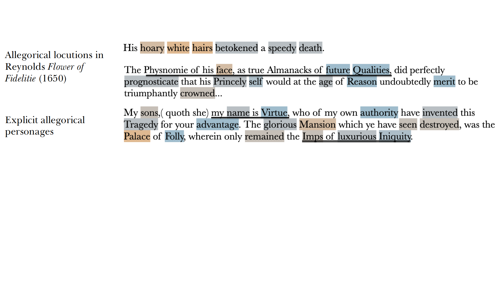

---

# Abstract and concrete language in allegory
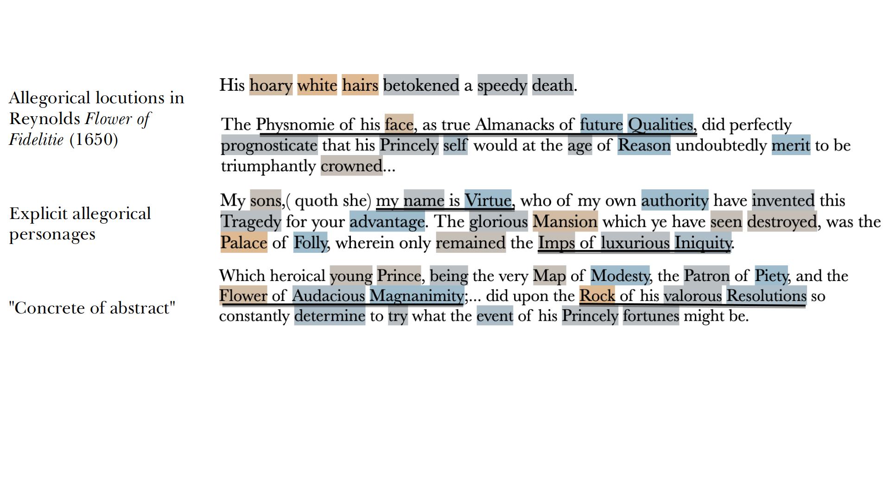

---

# Abstract and concrete language in allegory

---
background-image: url(imgs/trendmap.png)
# Ratio of abstract to concrete words
In canonical fiction, 1600-2000

---

background-image: url(imgs/trendmap--haywood.png)
# Ratio of abstract to concrete words
In canonical fiction, 1600-2000

---

# Abstract language in Haywood


---

# Abstract language in Haywood
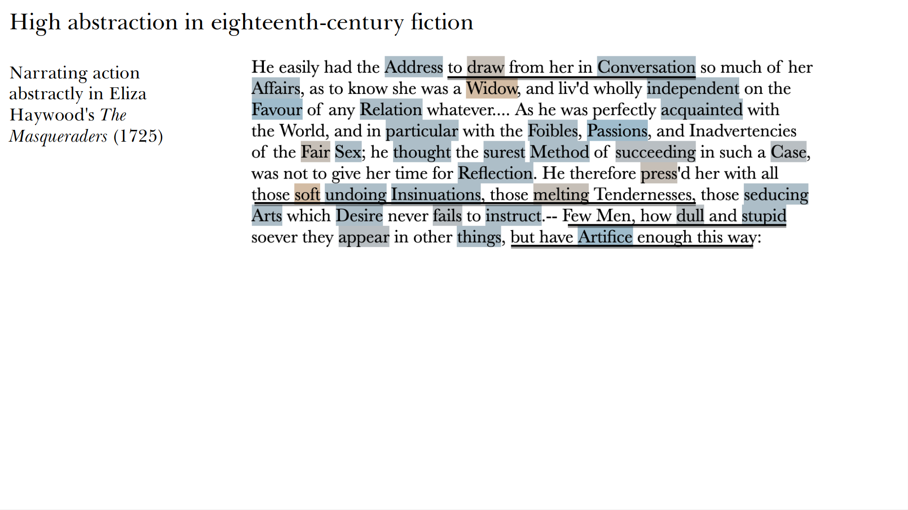


---

# Abstract interiority

.cols[
.thirty[
In Fielding's *Tom Jones* (1749)
]
.seventy[

]
]
  
--
.cols[
.thirty[
In Austen's *Sense and Sensibility* (1811)
]
.seventy[
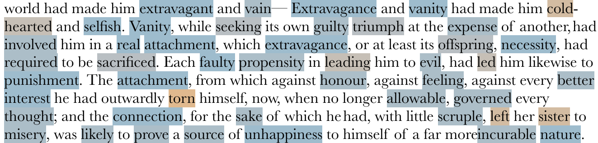
]
]


---
# Tell, don't show

She is perfectly sure of her own; for--if there were nothing else, and there is much--she has tasted blood, so to speak, in the form of her so prompt and auspicious success with the public, leaving all probations behind (the whole of which, as the book gives it, is too rapid and sudden, though inevitably so: <u>processes, periods, intervals, stages, degrees, connexions, may be easily enough and barely enough named, may be unconvincingly stated, in fiction, to the deep discredit of the writer, but it remains the very deuce to _represent_ them</u>, especially represent them under strong compression and in brief and subordinate terms; and this even though the novelist who doesn't represent, and represent "all the time," is lost, exactly as much lost as the painter who, at his work and given his intention, doesn't paint "all the time").

-- Henry James, Preface to _The Tragic Muse_ (1890)
---
background-image: url(imgs/trendmap.png)
# Ratio of abstract to concrete words
In canonical fiction, 1600-2000

---

background-image: url(imgs/trendmap--dickens.png)
# Ratio of abstract to concrete words
In canonical fiction, 1600-2000

---

# Concrete language in Dickens
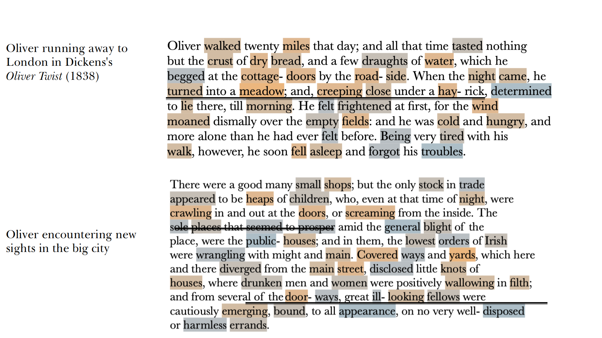

---

# Urban disorientation in _The Prelude_


---
# Concrete language in Dickens

---


# Concrete language in Dickens

.cols[
.thirty[
Mr. Krook introduced in _Bleak House_ (1853)
]
.seventy[

]
]
  
.cols[
.thirty[
Mr. Skimpole's apartments described
]
.seventy[
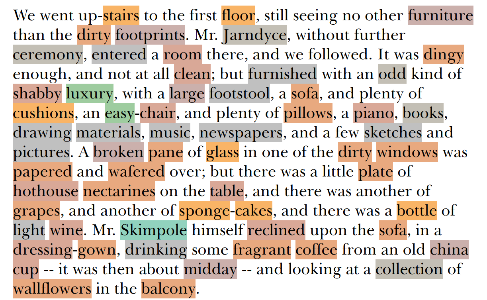
]
]

---

# Concrete character in C. Brontë
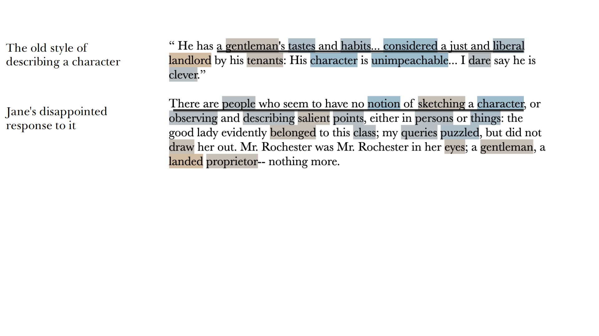

---

# Concrete character in C. Brontë

---
background-image: url(imgs/trendmap.png)
# Ratio of abstract to concrete words
In canonical fiction, 1600-2000

---

# Knowable communities
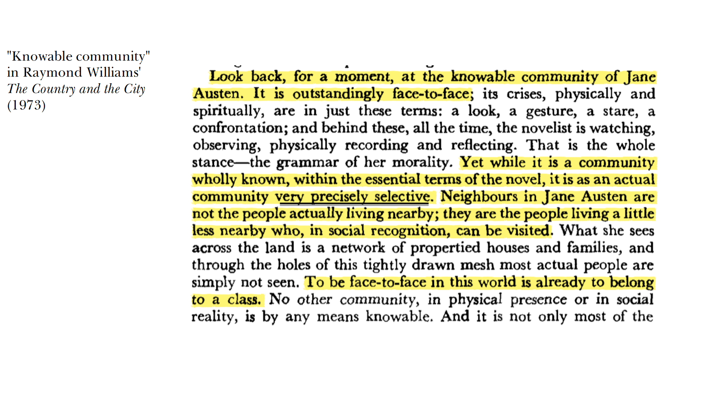

---
# Abstract language in Dickens
.cols[
.thirty[
Sudden burst of abstract analysis in Dickens' _Bleak House_
]
.seventy[

]
]

---

# Nineteenth-century objectivity
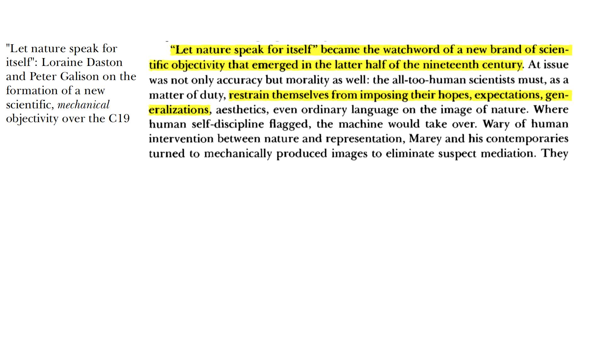
---
# Nineteenth-century objectivity


